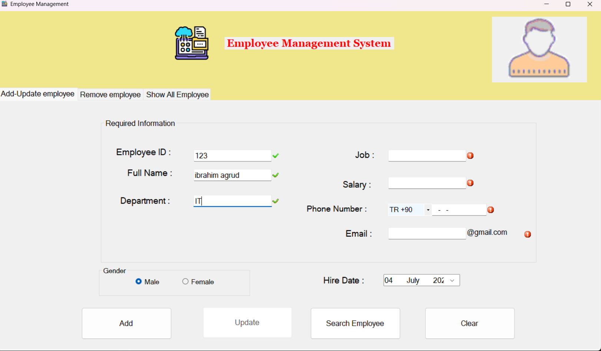
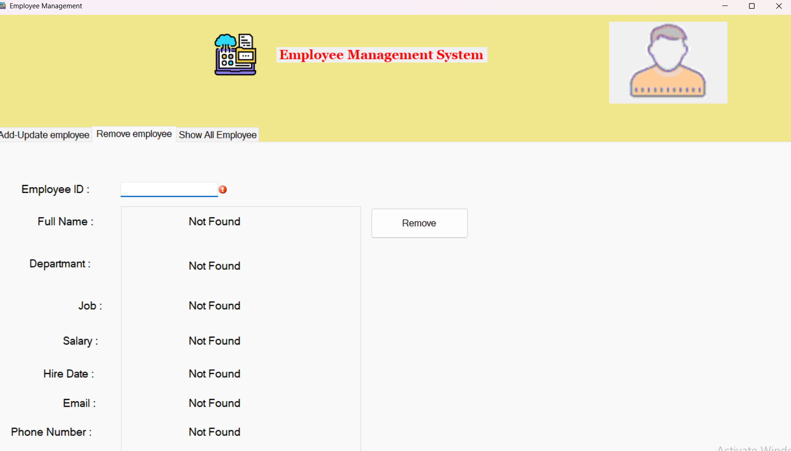
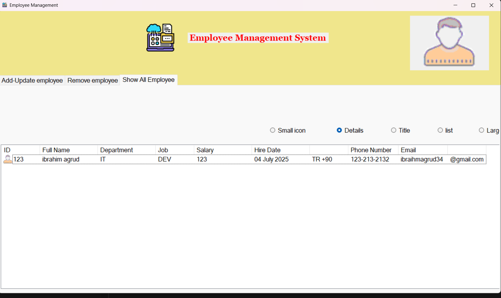

# 👨‍💼 Employee Management System

A simple Windows Forms application for managing employee records. This application allows users to add, view, update, and remove employee information. [Click here to watch the YouTube video for this project](https://www.youtube.com/watch?v=PP9bcHPwzMo)

------

# 🖼️ Screenshots


#### 🏠 Home Screen





#### Remove Employee Screen





####  


#### :telescope:Show Employees Screen





------


## ✨ Features

- **Add Employee:** Enter new employee details and add them to the system.
-  **View Employees:** Display employee records in various ListView formats (Details, Large Icon, Small Icon, Title, List).
- **Update Employee:** Search for an existing employee by ID and modify their details.
- **Remove Employee:** Delete employee records by ID.
- **Input Validation:** Basic validation for required fields using MaskedTextBoxes.
- **User Notifications:** Provides feedback through balloon tips.

------

## 🧰 Technologies Used

-  C#
-  .NET Framework (Windows Forms)

------

## 🚀 How to Use

1. Download and extract the project folder to your computer.
2. Open the folder.
3. Right-click on an empty space inside the folder and select **"Open in Terminal"**.
4. In the terminal, run the following command:

   ```
   Get-ChildItem -Recurse | Unblock-File
   ```

​    

5. Finally, double-click the `.sln` file in the folder to open the project in Visual Studio.

---

### 👨‍💼 Adding an Employee

1. Navigate to the "Add/Update Employee" tab.
2. Fill in the employee details in the provided fields.
3. Click the "Add" button.

------

### 📋 Viewing Employees

1. Select your desired view option (Details, Large Icon, etc.) from the radio buttons below the employee list.

------

### 🔍 Updating an Employee

1. In the "Add/Update Employee" tab, enter the employee's ID in the ID field.
2. Click the "Search Employee" button to load their details.
3. Modify the necessary fields.
4. Click the "Update" button.

------

### ❌ Removing an Employee

1. Navigate to the "Remove Employee" tab.
2. Enter the employee's ID in the "Employee ID" field.
3. The employee's details will appear if found.
4. Click the "Remove" button and confirm the action.
